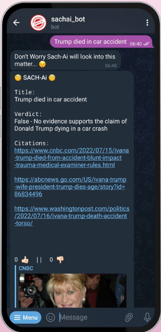
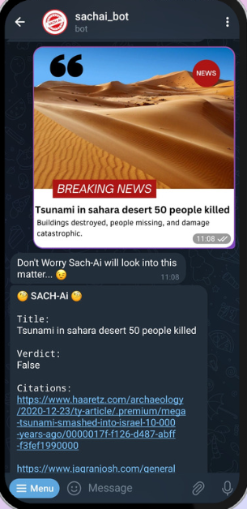
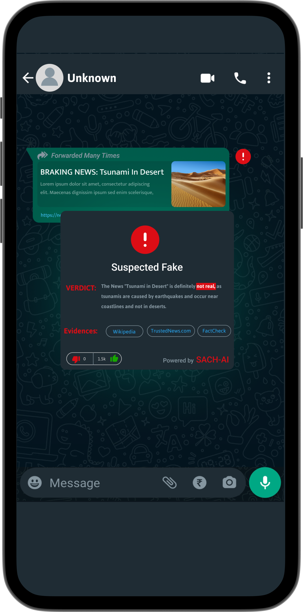

# **SACH-AI**: Advanced Fake News, Deep fake videos, Fake Image Detection (AI) for Social Media and a lot More

<p align="center">
    
</p>

[](https://github.com/keytoinnovation/SACH_AI_K2AI/blob/main/LICENSE)


## About

`SACH-AI` is an advanced artificial intelligence solution designed to combat the spread of misinformation and detect fake news across various mediums, including news headlines, articles, links, and even manipulated images and deep fake videos. It utilizes state-of-the-art techniques, such as linguistic analysis, social network analysis, fact-checking, machine learning, crowd-sourcing, and OCR + ML models to provide accurate and reliable results.


## Our Area for Fake/Misinformation Detection

- Text News(Title +- Body)
- Image
- Video


## Key Features

- Detection beyond textual content: SACH-AI goes beyond traditional methods by identifying fake or altered images, ensuring a comprehensive approach to misinformation detection.
- Specialized fine-tuned models: We employ multiple specialized models to extract sentiment, bias, hyperpartisan tendencies, and source credibility, supported by relevant evidence.
- Incremental/Online Learning: Our AI models utilize incremental/online learning techniques, continuously adapting to evolving fake news tactics for enhanced accuracy.
- Diverse approach to fake news detection: SACH-AI combines linguistic analysis (NLP/LLMs), social network analysis, fact-checking (search engines), machine learning (fine-tuned models), crowd-sourcing, and OCR + ML models for fake/altered image and deep fake video detection.

## Working Flow Chart


## ScreenShots

> ### Working Telegram Bot [@sachai_bot](https://t.me/@sachai_bot)

| Text News | Image | Video |
|---|---|---|
|  |  |  |

> ### Future Vision

| Messages  | WhatsApp | Twitter | GoogleSearch |
|---|---|---|---|
|  |  |  | |


## Getting Started

To get started with SACH-AI, follow these steps:


### Prerequisites

- Python 3.x
- Required libraries (specified in `requirements.txt`)


### Installation

0. Get this [Google Colab]()

1. Clone this repository:

   ```shell
   git clone
   ```

2. Navigate to the project directory:

   ```shell
   cd
   ```

3. Install the required libraries:

   ```shell
   pip install -r requirements.txt
   ```

### Usage
1. Stand Alone

    0. Open SACH-AI [Google Colab]():
    1. Select atleast `T4 GPU` in the Runtime

    2. Replace the `ENV` variables with your own
    3. Access SACH-AI `API` by visiting the `ngrok` url in your web browser.

2. Telegram Bot

    0. Open SACH-AI [Google Colab]():
    1. Select atleast `T4 GPU` in the Runtime and run the colab
    2. Create a Telegram Bot from [@botfather](https://t.me/botfather)
    3. In `SACH-AI/env.py` replace the values with your own
        ```python

            #env.py

            SACHAI_NGROK_URL = '<ngrok url from google colab>'
            TELEGRAM_BOT_ID = '<your telegram bot ID>'
            TELEGRAM_BOT_SECRET = '<your telegram bot secret>'

        ```
    4. Run the telegram Bot
        
        ```shell
        python main.py
        ```
    5. Now you can access SACH-AI bot on `https://t.me/<your_bot_username>`
        > example [https://t.me/sachai_bot]()

## Contributing

We welcome contributions from the community to enhance SACH-AI. To contribute, please follow these guidelines:

1. Fork the repository.
2. Create a new branch for your feature or bug fix.
3. Make your changes and commit them with descriptive messages.
4. Push your changes to your forked repository.
5. Submit a pull request detailing your changes and their benefits.


## Acknowledgments

We would like to acknowledge the following resources and libraries that have been instrumental in the development of SACH-AI:

- [LLaMA](https://example.com): Large Language Model.
- [Blip](https://example.com): Image Captioning Model.
- [DeepFake](https://example.com): Video Fake detection Model.
- [Keras OCR](https://example.com): OCR Model.

We express our gratitude to the open-source community for their valuable contributions and support.


## License 

[](https://github.com/keytoinnovation/SACH_AI_K2AI/blob/main/LICENSE)

---

**Disclaimer:** SACH-AI is an advanced artificial intelligence system but may not guarantee 100% accuracy in detecting fake news or altered images. It is important to critically evaluate information from multiple sources and exercise personal judgment when assessing the authenticity of news images or videos.
